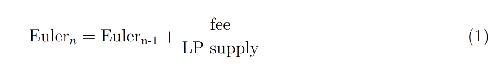
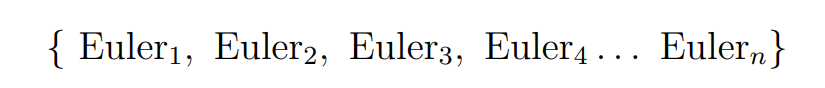
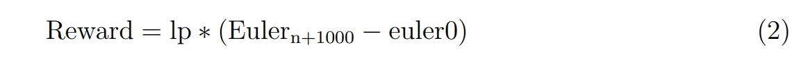

自动化做市商（AMM）目前面临一个显著挑战——它们难以有效促进区块链项目的长期成功。问题在于，代币创建者被鼓励优先考虑利润，通过快速撤回流动性和悄悄出售代币来实现。流动性提供者往往倾向于短期承诺，随着代币价值的上升，撤回并出售他们的流动性。这种结构上的不匹配妨碍了旨在长期成功的项目的发展。解决这个挑战至关重要，因为当前的 AMM 模型缺乏促进区块链生态系统持续增长和韧性的必要激励。
# 1 介绍

当前的 AMM 标准在每次交易中收取 0.3% 的费用，以代币形式支付。而 Ethervista 标准首次设定了仅用本地 ETH 支付的自定义费用。该费用巧妙地在特定池内的所有流动性提供者和代币创作者之间分配，使用一种新颖的机制，使我们能够以最低的 gas 成本向数百万用户分配奖励。创作者费用是可以分配给智能合约和资金库的协议费用。各种用例包括自动购买、质押奖励以及许多其他 DeFi 应用。

该模型的一个关键特性是，做市商和创作者从交易量中受益，而不是从代币价格中受益，这激励了长期持有而非短视的价格波动。投资者受益于延迟的流动性移除机制，防止开发者迅速进行 rug-pull。这种方法不仅降低了突发市场动荡的风险，还增强了投资的整体成功率。

最终，Ethervista 计划超越传统池，向构建 ETH-BTC-USDC 池迈进，以提供借贷、期货和无费用的闪电贷款，旨在成为一个一体化的去中心化应用程序。

# 2 技术概述：EtherVista 模型背后的数学原理

如前所述，每次交易都会收取本地 ETH 费用，该费用会分配给流动性提供者和协议。每个池必须初始化四个 uint8 费用变量，这些变量对应于买入和卖出交易的费用分配。这些变量对应于 USDC 金额，相关的 ETH 费用会在每次交易中通过链上预言机计算。例如，池可以初始化为买入费用 10 美元和卖出费用 15 美元。当用户决定出售他的代币时，他必须支付等值于 15 美元的 ETH 给协议和流动性提供者。协议分配的智能合约可以使用这笔费用来增加永久锁定的流动性，从而为该代币建立一个上升的地板价格，并为创作者提供可持续的收入。流动性提供者可以立即认领他应得的交易所收取的奖励。在本节中，我们描述流动性提供者费用的分配，下一节将详细说明协议费用的处理。

Ethervista 交易对智能合约维护一系列递增的数字，称为 Euler 金额。这些值在每次将本地 ETH 转移到交易对合约时更新。每个 Euler 金额通过将先前的 Euler 金额与费用与当前流动性提供者代币 (LP) 的总供应量的比率相加来确定。初始的 Euler 金额设置为零。

从数学上来说，此更新可以表示为：



具有相应的上升数字序列：



这段序列对流动性提供者特别重要。每个提供者由一个结构体表示，该结构体存储每个用户的流动性提供者持有量，以及一个名为 `euler0` 的变量，名称暗示其与我们序列中的 Euler 金额相关。

```
struct Provider {
uint256 lp ;
uint256 euler0 ;
};
```

这个 uint256 数字代表用户添加流动性时序列中的最新 Euler 数量，在这种情况下，我们有 euler0 = Eulern。假设用户决定在一千次交换后领取奖励。在那时，最新的 Euler 数量是 Eulern+1000。在这千次交换期间，该提供者累积的确切奖励金额是：



这种方法假设在整个期间内 LP 余额保持不变。因此，每当提供者采取任何行动，例如添加/移除流动性时，变量 euler0 将被刷新，以反映我们序列中的最新 Euler 数量。这一措施防止了流动性提供者操纵自身奖励份额。因此，建议流动性提供者在调整其 LP 余额之前始终领取奖励。LP 代币是不可转让的，除非在被销毁或添加/移除流动性时。

这种数学方法的本质在于能够准确确定每个用户在每次单独交换中获得的份额，无论由于流动性提供者添加或移除流动性而导致的 LP 代币总供应量的持续变化。

# 3 池子配置和协议费用

发起流动性提供的个人被称为创建者，拥有配置池设置的写入权限。这包括确定池费用、协议地址和元数据。关键参数是协议分配的智能合约地址。虽然这个参数是可选的，但默认设置为创建者的地址。随后，该地址将从协议费用中接收 ETH，通过智能合约的自定义逻辑进行管理，从而启用一系列以前在当前 AMM 标准下无法实现的 DeFi 应用。这种新的收入生成形式将重点从主要关注短期收益和价格波动转向更注重活动、持久性和实用性。

创建者可以为其代币定义链上元数据，包括网站 URL、标志、项目描述、社交媒体账号和聊天 URL 等详细信息。用户可以通过 Ethervista DEX 的浏览器窗口访问这些信息，以及其他相关细节。这使得创建者能够有效展示他们的项目，同时确保用户可以访问经过验证的安全信息，从而降低网络钓鱼攻击的风险。开发者可以使用集成的启动窗口无缝启动他们的项目。

Ethervista 还具有 SuperChat，这是一个直接集成到 DEX 平台的全球实时聊天功能，使用户能够快速交换信息。访问 SuperChat 采用分级制度，取决于用户持有的 VISTA 代币数量。

创建者可以选择放弃其写入权限，永久锁定所有设置。希望将其代币交易限制为仅在 Ethervista 上进行的创建者，可以将 ERC20 的 transferFrom 函数限制为 Ethervista 路由器地址，这是存储在工厂合约地址中的变量。

除了池和协议费用外，还分配固定的 1 美元费用用于 Ethervista DEX 和 $VISTA 的持续开发。该费用将用于无费用闪电贷、期货和借贷功能的实施，以及支持潜在的中心化交易所（CEX）上市和营销活动。

# 4 VISTA

$VISTA 是 DEX 的原生货币，供应量上限为 100 万个代币。Ethervista 是一种价值复合的通缩代币。Ethervista 协议的智能合约实施了一种链上过程，其中每次销毁事件不仅减少流通供应量，还逐步提高代币的价格底线。这个效果通过不断收购和销毁代币来维持，这些销毁的资金来自协议每笔交易产生的费用。因此，VISTA 的机制通过将活动与供应减少和价格底线增长相结合，充当对抗通货膨胀的对冲手段，随着每笔交易的进行，增强 VISTA 的价值，推动持续增长和稀缺性。

# 5 结论

It’s moontime baby!
